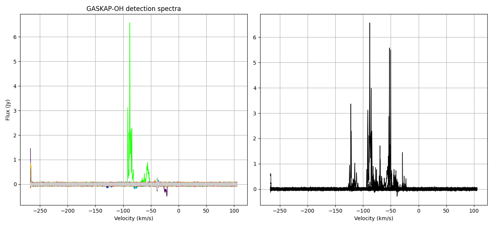
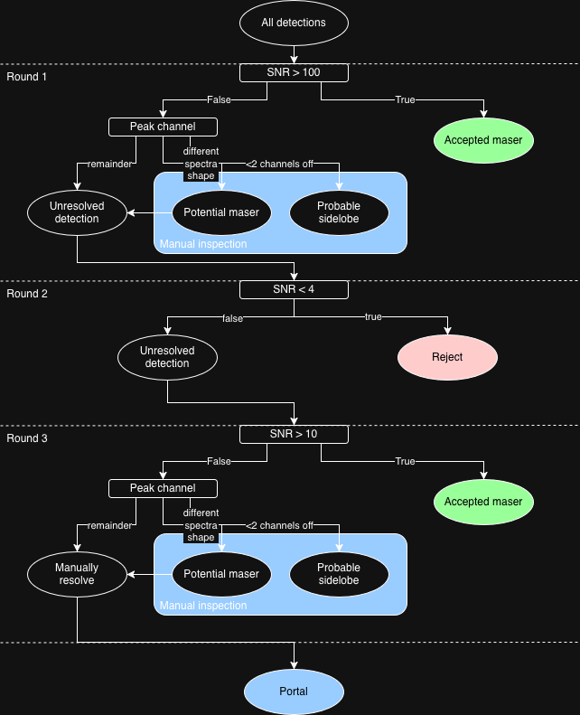

# GASKAP-OH

Code for the AusSRC GASKAP-OH data processing pipeline. Provides the following functionality:

* Runs the SoFiA-2 source finder on a GASKAP OH image cube
* Ingests the SoFiA outputs into the GASKAP OH database
* Python modules for various post-processing steps
    * Extract full spectra of a detection from the peak pixel location (rather than across the mask as is default in SoFiA)
    * Generate summary plots (example provided below, candidate sidelobe on left, accepted spectra on the right)
    * Run sidelobe rejection workflow (developed by Jay)
    * Reset selection for a SoFiA pipeline run (reset selection of masers, sidelobes and rejected sources to allow testing of sidelobe rejection workflow)



## Usage

The following command runs the pipeline. Note that it assumes all dependencies are installed and that all variables are provided. You will need to update the `process_cube.nf` file with these input variables.

```
module load nextflow/24.10.0
export PYTHON_ENV=/software/projects/ja3/ashen/venv/bin/activate
export SOFTWARE_DIR=/software/projects/ja3/ashen
nextflow run process_cube.nf -with-trace
```

## Environment

Create a Python virtual environment. We will install all Python dependencies here for all components of the pipeline, and reference this virtual env in the pipeline to ensure dependencies are available. The location of your virtual env will be set to the `$PYTHON_ENV` environment variable.

```
python3 -m venv path/to/venv
source path/to/venv/bin/activate
export PYTHON_ENV=path/to/venv/bin/activate
```

Then we will install all of the dependent software inside this virtual environment. This guide assumes you are installing on Setonix, which makes certain software (e.g. `wcslib=7.3`) available as a module. The following sections are the different software dependencies and how they can be installed. Activate the virtual environment for all installation steps below.

You may need to install the following if there are issues with setuptools:

```
pip install -U pip setuptools wheel
```

### s2p_setup

```
git clone https://github.com/AusSRC/s2p_setup.git
pip install -r s2p_setup/requirements.txt
```

### SoFiAX

```
git clone https://github.com/AusSRC/SoFiAX.git
cd SoFiAX
python setup.py install
```

### SoFiA-2

```
git clone https://gitlab.com/SoFiA-Admin/SoFiA-2
cd SoFiA-2
module load wcslib/7.3
make
```

### pipeline components

```
git clone https://github.com/AusSRC/pipeline_components.git
pip install -r pipeline_components/source_finding/requirements.txt
```

## Config

It is expected that all configuration files are found under the root of the project in a folder called `config`. Users will need to modify the contents of these parameter files (e.g. set the correct database credentials for ingest). The following templates are required for configuring the pipeline:

* [s2p_setup.ini](config/s2p_setup.ini)
* [sofiax.ini](config/sofiax.ini)
* [sofia_template.par](config/sofia_template.par)

## Sidelobe rejection

**NOTE: this is work in progress**



## Collaborating

Process:

1. Clone repository
2. Create a new branch for your feature
3. Switch to new branch inside of your development environment
4. Develop in that branch

The details:

1. Clone the repository and make asure it is up to date

```
git clone https://github.com/AusSRC/gaskap-oh.git
git fetch && git pull
```

2. Create new branch.

You can do this in the browser.

3. List all branches and switch to the branch of choice

```
git branch -a
git checkout -b <branch_name>
```

4. Develop

Write your code. Add the changes. Commit and push when you are ready.

```
git status
git add <file>
git commit -m "<commit message>"
git push --set-upstream origin <branch>
```

## Jay is here from May 6, 2026
